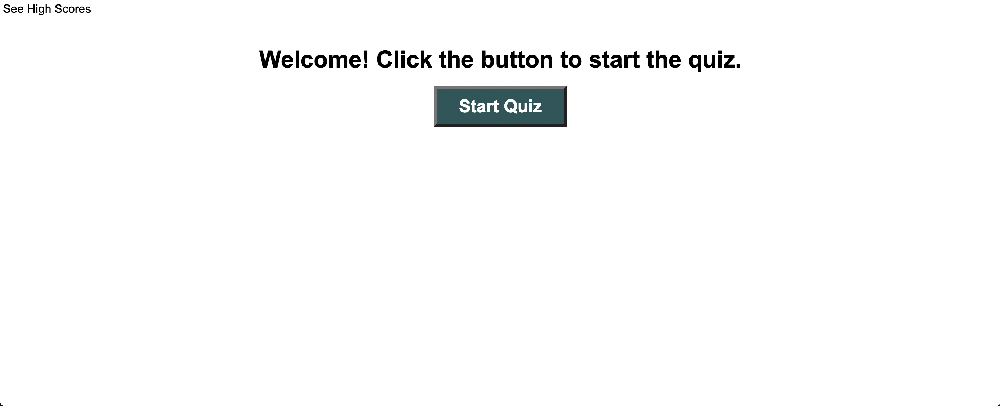

# JavaScript Quiz

## Description
This is a timed 5-question multiple choice JavaScript quiz. When a choice is clicked, the screen displays a message saying whether not it was correct. For every incorrect answer, the timer decrements by 15 seconds. If the time runs out, the quiz stops and the user gets a score of zero. Otherwise, the user gets a score equal to the time left on the timer. The user then has the option to add their initials and score to the leaderboard. If they submit their initials, they are taken to a new page where they can see a record of scores and corresponding initials. The user then has the option to either play again or to clear the scoreboard.

## Screenshot
 

## Live link

https://bdeutmeyer.github.io/javascript-quiz/

## Credits

My tutor, Ashton Foston, gave me important guidance. My instructor, Poornima Sewak, rewrote the portion of my code regarding rendering the scores to the high score page to make it work properly.

## Technologies used

HTML, CSS, and JavaScript

## License

None.